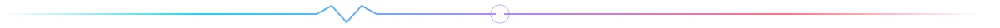
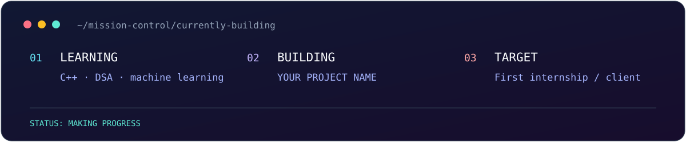
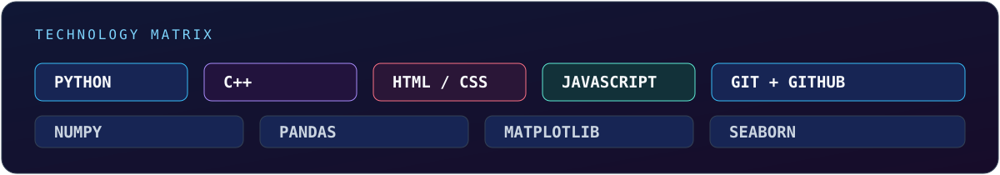
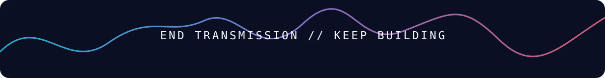

<!--
  SETUP
  1. Create a PUBLIC repository named exactly: YOUR-GITHUB-USERNAME
  2. Copy this README.md and the assets/ folder into that repository.
  3. Replace every ALL-CAPS placeholder. Keep the relative asset paths unchanged.
  4. Pin your best 4–6 project repositories from your GitHub profile page.

  This template uses only files stored in your own profile repository.
-->

<p align="center">
  
</p>

<p align="center">
  <a href="https://www.linkedin.com/in/YOUR-LINKEDIN-USERNAME">LINKEDIN</a>
  &nbsp;•&nbsp;
  <a href="mailto:YOUR.EMAIL@example.com">EMAIL</a>
  &nbsp;•&nbsp;
  <a href="https://YOUR-PORTFOLIO.com">PORTFOLIO</a>
</p>



## `// ABOUT_ME`

```ts
const developer = {
  name: "YOUR NAME",
  role: "Computer Science Student · Developer · Builder",
  location: "YOUR CITY, YOUR COUNTRY",
  focus: ["Web development", "Machine learning", "Problem solving"],
  currentlyBuilding: "YOUR CURRENT PROJECT OR GOAL",
  mindset: "Learn fast. Build useful things. Ship consistently."
};
```

I’m a first-year Computer Science student who enjoys turning ideas into useful products. I’m building strong fundamentals in programming, creating portfolio projects, and looking for opportunities to learn from real teams.



## `// SELECTED_WORK`

Replace these examples with links to your actual repositories. Write the outcome first, then the technology.

| Project | What it does | Built with |
| :-- | :-- | :-- |
| [PROJECT ONE](https://github.com/YOUR-GITHUB-USERNAME/PROJECT-ONE) | One clear sentence explaining the user problem it solves. | `Python` `Pandas` `Streamlit` |
| [PROJECT TWO](https://github.com/YOUR-GITHUB-USERNAME/PROJECT-TWO) | One clear sentence explaining the main feature or result. | `C++` `Algorithms` |
| [PROJECT THREE](https://github.com/YOUR-GITHUB-USERNAME/PROJECT-THREE) | One clear sentence explaining why this project is useful. | `HTML` `CSS` `JavaScript` |

> **Portfolio rule:** Pin projects that have a clean README, screenshots, a live demo (when possible), and a clear problem they solve. Do not pin unfinished tutorial clones.

## `// TECH_MATRIX`

<p align="center">
  
</p>

<p align="center">
  <code>PYTHON</code>&nbsp; <code>C++</code>&nbsp; <code>NUMPY</code>&nbsp; <code>PANDAS</code>&nbsp; <code>MATPLOTLIB</code>&nbsp; <code>SEABORN</code>&nbsp; <code>WEB DEVELOPMENT</code>
</p>

## `// BUILD_LOG`



- `NOW` — Learning **C++**, data structures, algorithms, and machine learning foundations.
- `BUILDING` — Add your current project, product, or open-source contribution here.
- `OPEN TO` — Internships, beginner-friendly open source, hackathons, and thoughtful collaborations.
- `REACH ME` — [YOUR.EMAIL@example.com](mailto:YOUR.EMAIL@example.com)

<br clear="right" />


<p align="center">
  <i>"Small consistent builds become a strong portfolio."</i>
</p>

<p align="center">
  
</p>
